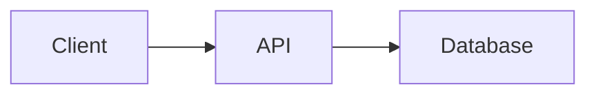
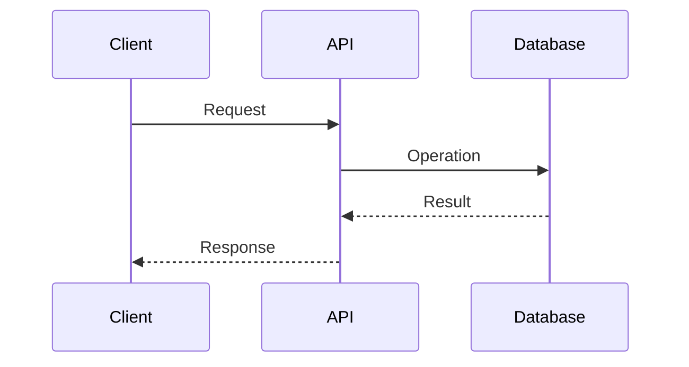

# [Feature] — Technical Design Document

## Document status

- **Status:** Draft
- **Owner:** TBD
- **Last updated:** YYYY-MM-DD

## Executive summary

## Context

## Goals

## Non-goals

## Existing system

## Proposed architecture

## Components and responsibilities

## Data model

## API contracts

## Main flows

## Security

## Reliability and failure handling

## Observability

## Performance and capacity

## Migration and compatibility

## Testing strategy

## Deployment

## Rollback and recovery

## Alternatives considered

## Risks and mitigations

## Delivery plan

## Open questions

## References
