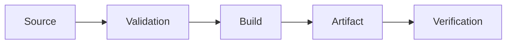

# Platform Implementation Report

## 1. Platform status

`PLATFORM IMPLEMENTATION COMPLETE | PLATFORM IMPLEMENTATION COMPLETE WITH LIMITATIONS | CHANGES REQUIRED | APPLICATION OR ARCHITECTURE BLOCKER | BLOCKED`

Rationale:

## 2. Scope implemented

- Local environment:
- CI:
- Containers:
- Security scanning:
- Artifacts:
- Release:
- Observability:
- Documentation:

## 3. Files created

## 4. Files modified

## 5. Pipeline and environment flow

## 6. Security and secrets review

- CI permissions:
- Action pinning:
- Secret sources:
- Public configuration:
- Private configuration:
- Container user:
- Image scanning:
- SBOM:

## 7. Validation evidence

- **Command:**
- **Purpose:**
- **Target environment:**
- **Result:**
- **Exit status:**
- **Warning or failure:**

## 8. Deployment and recovery

## 9. Observability

## 10. Remaining limitations

## 11. Handoffs
