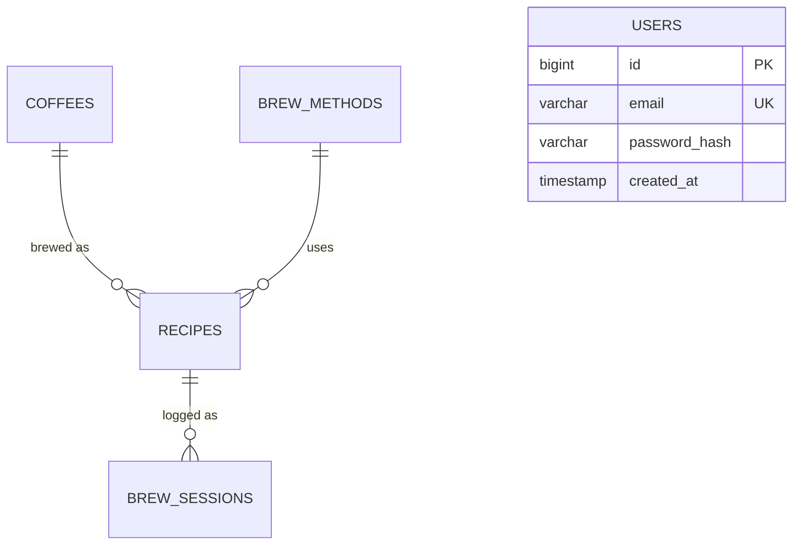

# Database Design

PostgreSQL 16, schema versioned by Flyway (`brewdeck-api/src/main/resources/db/migration/`).

## Migrations

| Version | Purpose |
| ------- | ------- |
| V1 | Initial schema: `coffees`, `brew_methods`, `recipes`, `brew_sessions` |
| V2 | Seed initial brew methods |
| V3 | Replace free-text coffee tasting fields with numeric `*_score` columns |
| V4 | Add nullable `share_token` on `recipes` + partial unique index |
| V5 | Create `users` table |

## Entity relationships

> Note: `users` exists but is not yet linked to domain tables. Per-user ownership FKs land in Phase 6 Slice B.

## Tables

### coffees
Coffee profiles. Key columns: `name` (required), `brand`, `origin`, `region`, `farm`, `producer`, `variety`, `process`, `roast_level`, `notes_primary`, `notes_secondary`, numeric tasting scores `acidity_score` / `body_score` / `sweetness_score` / `bitterness_score`, `description`, `created_at`, `updated_at`.

### brew_methods
Brewing methods. `name` (required, unique), `description`, `created_at`. Seeded in V2.

### recipes
Brewing recipes. FKs: `coffee_id → coffees(id)`, `method_id → brew_methods(id)` (both required). Params: `coffee_grams`, `water_grams`, `ratio`, `grind_setting`, `water_temp`, `brew_time`, `steps`, `expected_taste`, `favorite` (default false), `share_token` (nullable, unique when set), timestamps.

### brew_sessions
Brew logs. FK: `recipe_id → recipes(id)` (required). `brewed_at`, actuals (`actual_grind`, `actual_temp`, `actual_time`), `taste_result`, `rating`, `adjustment_notes`.

### users
Accounts. `id`, `email` (unique), `password_hash` (BCrypt), `created_at`.

## Conventions

- Surrogate `BIGINT` identity primary keys.
- `created_at` defaults to `CURRENT_TIMESTAMP`; `updated_at` set on modification where present.
- Referential integrity enforced by FKs; partial unique index guards non-null share tokens.

> `TODO`: add indexes for high-traffic filter/sort columns once query volume justifies it.
