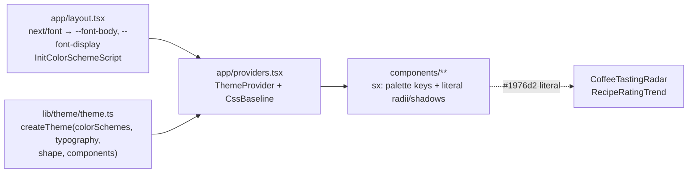
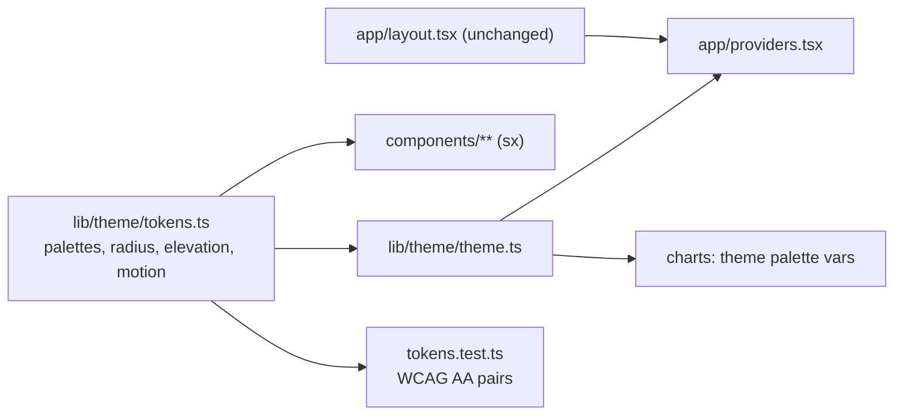

# Technical Design Document: Web Design Foundation

Status: Implemented (token refactor on branch `refactor/web-theme-tokens`, 2026-10-05).

Workstream 1 of the Phase 7 UI/UX refresh. Decision record: [ADR-014](../decisions/ADR-014-ui-design-system-mui-theme-tokens.md).

## 1. Summary

BrewDeck's web UI is styled through a single MUI theme (`brewdeck-web/src/lib/theme/theme.ts`) with two color
schemes: **light = direction A (warm café)** and **dark = direction C's palette (dark premium)**. Fonts load
through `next/font`, and the theme emits CSS variables so the mode switches without a flash on load.

The foundation was built as a proof of concept (PR #173) and every other workstream (2–7, 9) was built on it.
This TDD records the architecture as built and closes the gaps the workstreams exposed:

- Radius, shadow, and motion values are repeated as literals in components (`'18px'`, `'10px'`, a hover shadow).
- Two charts still use MUI's default blue `#1976d2`, which belongs to neither palette.
- Nothing guards palette contrast, so a token change could silently break WCAG AA.

Affected area: `brewdeck-web` only. No backend, API, or database change.

## 2. Context

- Stack: Next.js 16 (App Router), React 19, MUI 9 + Emotion, recharts 3 ([ADR-004](../decisions/ADR-004-nextjs-mui-tanstack-query.md)).
- Diagnosis, the three directions, and POC results: [UI/UX refresh spike](../product/spikes/ui-ux-refresh-spike.md) (§10, §12, Appendix A).
- Per-user theme preference (backend `themePreference`, Account toggle, first-login dialog): [theme-preference FDD](../product/fdd/theme-preference-fdd.md). That workstream decides *which* mode is active; this one defines *what each mode looks like*.

## 3. Goals

- Keep one source of truth for visual tokens: palette, typography, shape, elevation, motion.
- Keep components free of raw colors and repeated magic numbers.
- Light and dark both meet WCAG 2.2 AA (4.5:1 for text), enforced by a test.
- No flash of the wrong mode on first paint.
- The theme stays importable in Vitest (no dependency on `next/font` at test time).

## 4. Non-Goals

- No new component library, design-token pipeline (Style Dictionary, Figma sync), or Tailwind.
- No storybook or visual-regression tooling (TODO: revisit if the UI grows).
- Directions B and C as full themes: tokens are kept in the spike's Appendix A only.
- Which mode is active and where it is stored: theme-preference FDD.
- i18n (workstream 8).

## 5. Requirements Reference

- Spike §7 constraints (keep MUI, WCAG AA, behavioral tests must not change) and §16 decision.
- Spike §17, row 1: "Tokens, typography, shape, shadows, component overrides, dark mode".
- TODO: No FDD exists for this workstream; it has no user-facing behavior of its own.

## 6. Current Architecture



As built:

| Concern | Where | How |
| --- | --- | --- |
| Color schemes | `theme.ts` | `cssVariables: { colorSchemeSelector: 'class' }`, `colorSchemes.light` / `dark` |
| Custom palette keys | `theme.ts` | `background.sidebar`, `background.tint` via module augmentation of `TypeBackground` |
| Fonts | `layout.tsx` | `DM_Sans` (body) and `Fraunces` (display) from `next/font/google`, `display: 'swap'`, exposed as CSS variables; `theme.ts` reads `var(--font-body)` / `var(--font-display)` with system fallbacks |
| No-flash mode | `layout.tsx` | `InitColorSchemeScript attribute="class"` sets the class on `<html>` before hydration; `suppressHydrationWarning` on `<html>` |
| Mode persistence | `theme.ts` → `providers.tsx` | `THEME_MODE_STORAGE_KEY = 'brewdeck-theme-mode'` shared by the script and `ThemeProvider` |
| Shape | `theme.ts` | `shape.borderRadius: 12` (controls); cards 18 in the `MuiCard` override |
| Elevation | `theme.ts` | Light: soft two-layer shadow on cards. Dark: no shadow, 1 px `divider` border |
| Overrides | `theme.ts` | `CssBaseline`, `Button`, `Card`, `Paper` (outlined), `TableCell`, `Chip`, `OutlinedInput`, `Drawer`, `ListItemButton`, `ListItemIcon` |

Drift found while writing this TDD (as of 2026-10-05):

| Value | Occurrences |
| --- | --- |
| `borderRadius: '18px'` (card radius, repeated outside `MuiCard`) | `TableSkeleton`, `BrewMethodsTable`, `BrewSessionsTable` |
| `borderRadius: '10px'` / `'12px'` / `'14px'` (inner radii) | `StatCard`, `RecipeCards`, `AppShell` (×3) |
| `borderRadius: 999` (pill) | `CoffeeCards` (×2), `MethodUsage`, `RankedList`, `BrewSessionsTable` |
| Card hover shadow and `150ms` transition | `CardGrid` (literal, light-mode colors only) |
| `#1976d2` (MUI default blue) | `CoffeeTastingRadar`, `RecipeRatingTrend` |

## 7. Proposed Architecture

Keep the single theme. Add a small, typed tokens module that both the theme and the components read, and a
contrast test over the palette.



Rules every component follows:

1. **Colors** come from palette keys in `sx` (`'primary.main'`, `'background.tint'`) or `theme.vars.palette.*`. No hex, `rgb()`, or MUI default colors in `components/`.
2. **Radii** come from `radius.*` tokens, not string literals. Note: a bare number in `sx.borderRadius` is multiplied by `shape.borderRadius` (12), so `borderRadius: 1.5` means 18 px. Tokens are px strings to avoid that trap.
3. **Elevation** comes from the theme: `Card` gets its shadow from the override; hover elevation uses `elevation.cardHover`, and dark mode keeps borders instead of shadows (`theme.applyStyles('dark', …)`).
4. **Motion** uses `motion.*` durations and always has a `@media (prefers-reduced-motion: reduce)` fallback (as `CardGrid` does today).
5. **Typography**: serif display font for `h1`–`h6` only; body, tables, numbers, and buttons use the body font.
6. **New override first**: if three or more components restyle the same MUI component the same way, move it into `theme.components`.

## 8. Component Design

### 8.1 `src/lib/theme/tokens.ts` (new)

Plain `as const` objects, no MUI import, so they are cheap to test:

```ts
export const palettes = {
  light: { primary: '#5B3A29', onPrimary: '#FFF8EF', /* … every value now inline in theme.ts */ },
  dark: { primary: '#D4A55A', onPrimary: '#1A130E', /* … */ },
} as const;

export const radius = { control: '12px', inner: '10px', card: '18px', pill: '999px', round: '50%' } as const;

export const elevation = {
  card: '0 1px 2px rgba(43, 29, 20, 0.06), 0 8px 24px rgba(43, 29, 20, 0.05)',
  cardHover: '0 2px 4px rgba(43, 29, 20, 0.08), 0 12px 28px rgba(43, 29, 20, 0.1)',
} as const;

export const motion = { fast: '150ms', easing: 'ease' } as const;
```

`AppShell`'s `14px` (user card) becomes `radius.card` (OQ-002).

### 8.2 `src/lib/theme/theme.ts` (changed)

- Builds `colorSchemes` from `palettes` instead of inline hex.
- `shape.borderRadius` and the `MuiCard` / `MuiButton` / `MuiOutlinedInput` / `MuiListItemButton` overrides read `radius` and `elevation`.
- The three `'18px'` table/skeleton literals become `radius.card` in `sx`. A `MuiTableContainer` override was rejected during implementation: with `component={Paper}` the Paper's own radius class competes with it, and a `MuiPaper` outlined override would also hit every outlined `Card`.
- Public exports unchanged: `theme`, `THEME_MODE_STORAGE_KEY`.

### 8.3 Charts

`CoffeeTastingRadar` and `RecipeRatingTrend` take their stroke/fill from the theme
(`theme.vars.palette.primary.main` / `secondary.main`) so they follow the active mode.

recharts passes the value straight to the SVG `stroke`/`fill` attribute. Headless Chrome resolves `var()` in
an SVG presentation attribute (checked 2026-10-05). Without a CSS-variables theme (tests rendering without the
provider) the components fall back to the plain palette value: `(theme.vars ?? theme).palette.primary.main`.
TODO: confirm in Safari and Firefox.

### 8.4 Unchanged

`layout.tsx` (fonts, `InitColorSchemeScript`), `providers.tsx`, `themePreference.ts`, and the theme-preference
components.

## 9. Data Model

Not applicable. No persisted data. (The per-user `theme_preference` column belongs to workstream 7.)

## 10. API Design

Not applicable. No endpoint is added or changed.

## 11. Validation Rules

- VR-001: Every text/background pair used by the UI has a contrast ratio ≥ 4.5:1 in both modes (WCAG 2.2 AA, 1.4.3).
- VR-002: `primary`/`secondary` and their `contrastText` ≥ 4.5:1 (button labels).
- VR-003: No hex or `rgb()` color literal in `src/components/**` outside tests.

Current ratios (computed 2026-10-05 with the WCAG relative-luminance formula):

| Pair | Light | Dark |
| --- | --- | --- |
| `text.primary` on `background.default` / `paper` | 14.29 / 15.82 | 15.91 / 14.76 |
| `text.secondary` on `default` / `paper` / `sidebar` / `tint` | 6.05 / 6.69 / 5.50 / 5.47 | 6.77 / 6.28 / 6.97 / 5.93 |
| `primary.main` on `paper` / `tint` | 9.79 / 8.01 | 7.80 / 7.36 |
| `primary.contrastText` on `primary.main` | 9.57 | 8.16 |
| `secondary.contrastText` on `secondary.main` | 5.54 | 9.90 |

Lowest: 5.47 (`text.secondary` on `tint`, light).

## 12. Error Handling

| Error Type | Handling Strategy | User/System Response |
| --- | --- | --- |
| Google Fonts unavailable at build | `next/font` self-hosts at build time; the build fails loudly | CI fails; no runtime impact |
| Font slow to load | `display: 'swap'` + system fallbacks in the font stacks | Fallback font, then swap |
| No stored mode / storage blocked | `InitColorSchemeScript defaultMode="light"` | Light mode |
| Contrast regression | `tokens.test.ts` fails | CI fails before merge |

## 13. Security Considerations

- No secrets, data, or auth involved.
- `InitColorSchemeScript` is an inline script from MUI. TODO: if a strict Content-Security-Policy is added later, it needs a nonce or hash.
- `localStorage` stores only `'light'` / `'dark'`; nothing sensitive.

## 14. Observability

Not applicable at runtime. Quality signals live in CI: unit tests (contrast), `pnpm build`, and Lighthouse
manually when checking font cost (TODO: no Lighthouse in CI yet).

## 15. Performance and Scalability

- Two font families through `next/font`, self-hosted and subset to `latin`. Assumption: Fraunces and DM Sans load as variable fonts, so weights 400–600 cost one file each.
- CSS variables mean switching mode changes one class on `<html>`; no re-render of the React tree.
- Moving literals into tokens has no runtime cost.

## 16. Transaction and Consistency Strategy

Not applicable (no writes). Consistency between modes is enforced by building both schemes from the same
`tokens.ts` shape: a key missing in one palette is a TypeScript error.

## 17. Testing Strategy

### Unit tests (Vitest)

- `src/lib/theme/tokens.test.ts` (new): a small `contrastRatio(a, b)` helper; one table-driven test per VR-001 / VR-002 pair, per mode.
- `theme.ts` smoke test (new): `theme.colorSchemes.light` / `dark` exist; `palette.background.tint` and `sidebar` are defined in both; `typography.h1.fontFamily` includes `--font-display`.

### Component tests

No change expected. Existing tests query by role and text, not by style, so token refactors must keep them
green unchanged (spike Q-005). A failing behavioral test means markup changed and is a bug in the refactor.

### Static check

- VR-003: a test scans `src/components/**/*.tsx` (excluding tests) for hex and `rgb()` literals (OQ-001).

### Manual

- Both modes at 1280 px and 390 px: Dashboard, Coffees, Recipes, a coffee detail (radar), a recipe detail (trend), Brew Sessions, Login.
- Reload in dark mode: no light flash.
- `prefers-reduced-motion: reduce`: card hover does not move.

### Not applicable

Integration, contract, OpenAPI, and Postman tests: no API change.

## 18. Rollout Plan

- One frontend PR after this document (`refactor(web): …`), no feature flag: purely visual, complete in one PR, no backend side effects (evaluated against the Feature Flag Policy).
- Rollback: revert the PR.

## 19. Alternatives Considered

| Option | Pros | Cons | Decision |
| --- | --- | --- | --- |
| MUI theme + CSS variables + small `tokens.ts` | Uses what is built; typed; no new tool | Tokens live in TS, not shareable with non-JS tools | **Chosen** |
| MUI module augmentation (`theme.radius`, `theme.elevation`) | Tokens reachable from `sx` callbacks | More type plumbing; `sx` callbacks for every literal | Rejected for now; revisit if tokens grow |
| Design-token pipeline (Style Dictionary) | Platform-agnostic tokens | Build step and tooling for one web app | Rejected |
| Tailwind / CSS modules alongside MUI | Utility classes | Two styling systems; fights Emotion | Rejected |
| Raw `ThemeProvider` per mode (no CSS variables) | Simpler mental model | Flash of light theme on dark reload under SSR | Rejected (spike Q-002) |

## 20. Risks and Mitigations

| Risk | Impact | Mitigation |
| --- | --- | --- |
| Token refactor changes a radius or shadow by accident | Visual regression | Map literals 1:1 to tokens; manual check list in §17 |
| SVG `stroke="var(…)"` unsupported | Chart loses color | Pass the color through `style`; verify in both modes |
| A new palette value fails contrast | Accessibility regression | `tokens.test.ts` blocks the merge |
| Contributors keep writing literals | Drift returns | VR-003 check; rule in [coding standards](../development/coding-standards.md) |

## 21. Open Questions

- ~~OQ-001: ESLint rule or a file-scanning test for VR-003?~~ Answered 2026-10-05: a test (simpler, no false positives on non-style strings).
- ~~OQ-002: `AppShell` user card radius `14px`?~~ Answered 2026-10-05: `radius.card` (18 px).
- OQ-003 (from spike §19): there is no logo or brand mark yet (confirmed 2026-10-05); the app keeps its placeholder icon. Resolved in the [brand mark spike](../product/spikes/brand-mark-spike.md): concept B (bean on a deck), delivered as `BrandMark` + `Wordmark`.

## 22. Assumptions

- Assumption-001: The palette in `theme.ts` today is the accepted design; this work moves values, it does not change them.
- Assumption-002: Charts can take theme CSS variables (§8.3); verified in Chrome, Safari and Firefox TODO.
- Assumption-003: Both fonts load as variable fonts (§15).

## 23. Implementation Plan

1. Add `src/lib/theme/tokens.ts` with the current values, 1:1.
2. Add `tokens.test.ts` (contrast, VR-001/VR-002) and the theme smoke test.
3. Build `theme.ts` from tokens; add the table-container radius override.
4. Replace radius, shadow, and motion literals in the components listed in §6.
5. Theme the two charts; check them in the browser in both modes.
6. Add the VR-003 check as a test (OQ-001).
7. Add the styling rules from §7 to `docs/development/coding-standards.md`.
8. `pnpm test`, `pnpm type-check`, `pnpm lint`, `pnpm build`; manual check list (§17).
