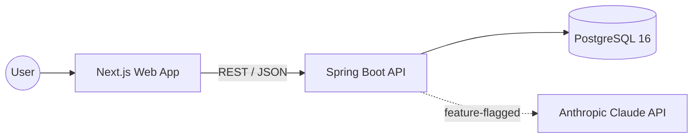
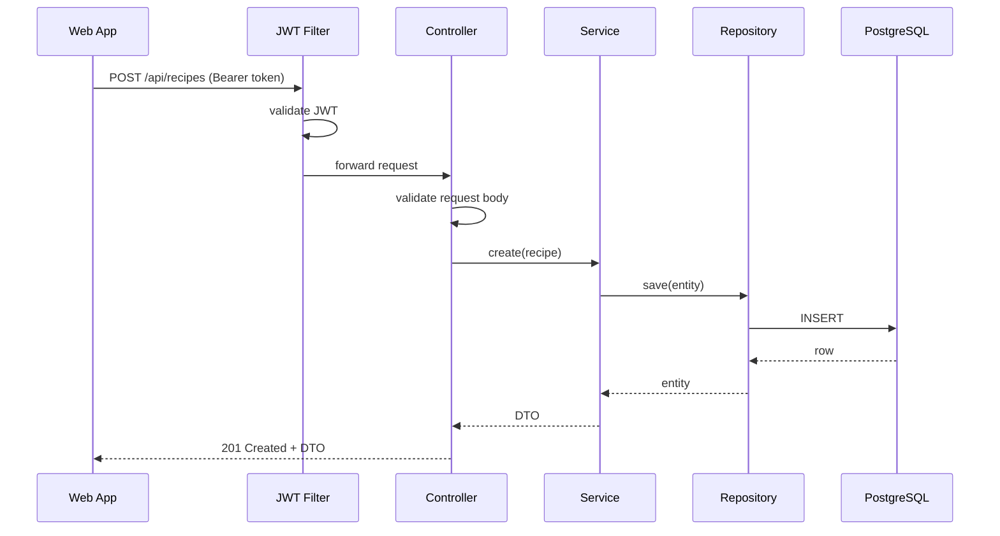
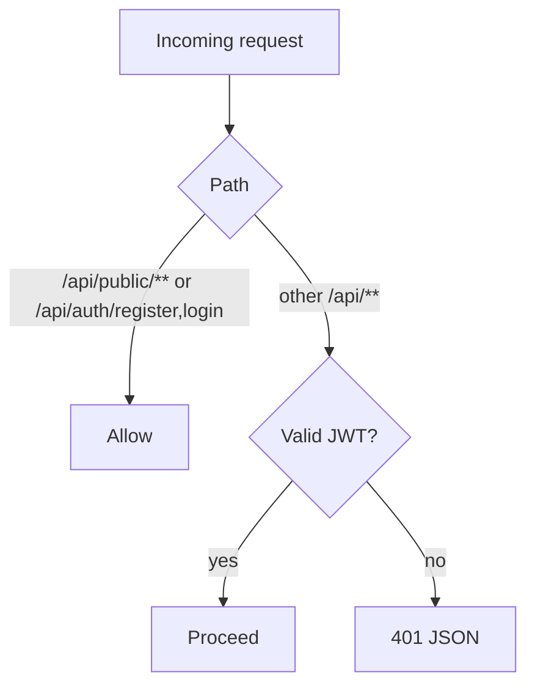

# Diagrams

Central place for BrewDeck Mermaid diagrams. Keep them close to the code they describe.

## System context

## Request lifecycle (authenticated write)

## Auth gate

> Add feature-specific diagrams here or inline in the relevant spec under `docs/superpowers/specs/`.
