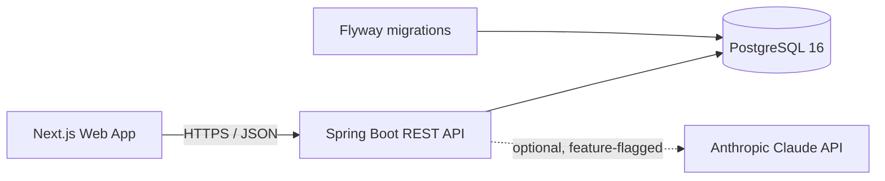

# Architecture Overview

BrewDeck is a two-tier application: a Spring Boot REST API and a Next.js web client, backed by PostgreSQL.

## Components

| Component | Tech | Responsibility |
| --------- | ---- | -------------- |
| `brewdeck-api` | Java 21, Spring Boot 3.5, Spring Data JPA | REST API, business logic, persistence, auth |
| `brewdeck-web` | Next.js 16, React 19, TypeScript, MUI | Web UI, data fetching via TanStack Query |
| PostgreSQL 16 | Docker Compose | Relational store; schema versioned by Flyway |
| Anthropic API | Claude (via Java SDK) | Optional, feature-flagged AI recipe suggestions |

## High-level shape

## Backend structure

Package-by-domain (modular monolith). Each domain owns its controller, service, repository, entity, DTOs, filters, and mapper.

- Domains: `coffee`, `method`, `recipe`, `session`, `dashboard`, `ai`, `auth`
- Cross-cutting: `common` (config, error handling, pagination), `integration`

See [ADR-001](../decisions/ADR-001-modular-monolith-package-by-domain.md).

## Data flow (typical write)

1. Client sends a validated JSON request to a controller.
2. Controller maps the request record to a service call.
3. Service enforces business rules and coordinates the repository.
4. Repository persists via JPA/Hibernate to PostgreSQL.
5. Controller returns an explicit DTO with a RESTful status code.

## Security posture

- Stateless JWT gate on all `/api/**` except `/api/public/**` and `/api/auth/{register,login}`.
- BCrypt password hashing. Secrets come from environment variables only.
- See [ADR-005](../decisions/ADR-005-stateless-jwt-auth.md).

## Related

- [Technical design](technical-design.md) · [Database design](database-design.md) · [API design](api-design.md) · [Diagrams](diagrams.md)
