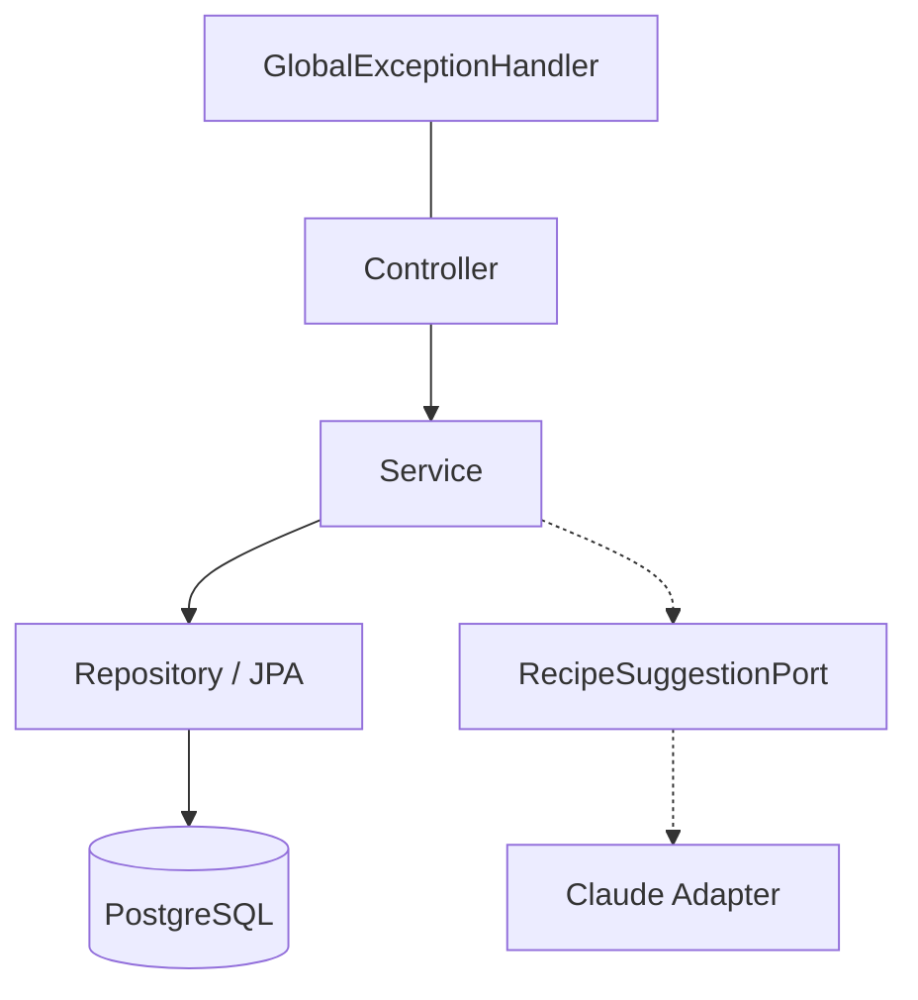

# Technical Design: BrewDeck Backend

A system-level TDD for the API. Per-feature designs live in
[`docs/superpowers/specs/`](../superpowers/specs/).

## Context

Spring Boot 3.5 REST API on Java 21, PostgreSQL 16, Flyway-managed schema. Organized package-by-domain. Consumed by a Next.js web client and (manually) by Postman/Swagger.

## Goals

- Predictable, RESTful endpoints with consistent pagination and error shapes.
- Clean separation: controller → service → repository, with explicit DTOs.
- Testable design (unit + integration via Testcontainers).
- Feature-flagged, swappable AI integration.

## Non-Goals

- Microservices or event-driven messaging.
- Multi-tenant isolation (per-user ownership is a future slice).
- Server-side rendering of domain data (the web client owns presentation).

## Proposed Solution

A modular monolith. Each domain package exposes a controller and keeps its own service, repository, entity, DTO records, filter/specification, and mapper. Shared concerns live in `common`.

## Architecture



- **Controller** — HTTP mapping, request validation, status codes; returns DTOs only (never entities).
- **Service** — business rules, transactions, coordination.
- **Repository** — Spring Data JPA + Specifications for filters.
- **Ports/adapters** — the AI integration is a port with a Claude adapter (hexagonal), feature-flagged.

## Data Model

See [database-design.md](database-design.md). Entities: `coffees`, `brew_methods`, `recipes`, `brew_sessions`, `users`.

## API Design

See [api-design.md](api-design.md). Conventions: collection GETs return `PageResponse<T>`; GET-by-id returns the DTO; bounded analytics return `List<T>`.

## Validation Rules

- Bean Validation on all `*Request` records (required fields, sizes, numeric ranges).
- Avoid special symbols in validation messages (responses are sanitized — write "degrees Celsius", not the symbol).

## Error Handling

Centralized `GlobalExceptionHandler` returns a consistent `ErrorResponse`:

```json
{
  "status": 400,
  "error": "Bad Request",
  "message": "Validation failed",
  "path": "/api/example",
  "validationErrors": { "field": "message" }
}
```

Status codes: 400 validation, 401 unauthenticated, 404 not found, 409 conflict, 422 unprocessable (e.g. AI improve with no rated history), 503 AI disabled/unavailable, 500 unexpected.

## Testing Strategy

Service, controller (MockMvc), repository, specification, and integration (Testcontainers) layers. See [testing/testing-strategy.md](../testing/testing-strategy.md).

## Security Considerations

Stateless JWT filter chain, BCrypt hashing, env-only secrets, CORS restricted to configured origins. See [ADR-005](../decisions/ADR-005-stateless-jwt-auth.md).

## Observability

Structured logs on write operations; `/actuator/health` probe. Metrics/tracing are `TODO` (not yet configured).

## Alternatives Considered

- **Package-by-layer** instead of by-domain — rejected for weaker cohesion. See [ADR-001](../decisions/ADR-001-modular-monolith-package-by-domain.md).
- **Persisting AI output directly** — rejected; suggestions stay ephemeral until the user saves.

## Open Questions

- OQ-001: Add metrics/tracing (Micrometer + OpenTelemetry)? `TODO`.
- OQ-002: Introduce API versioning before Slice B? `TODO`.
